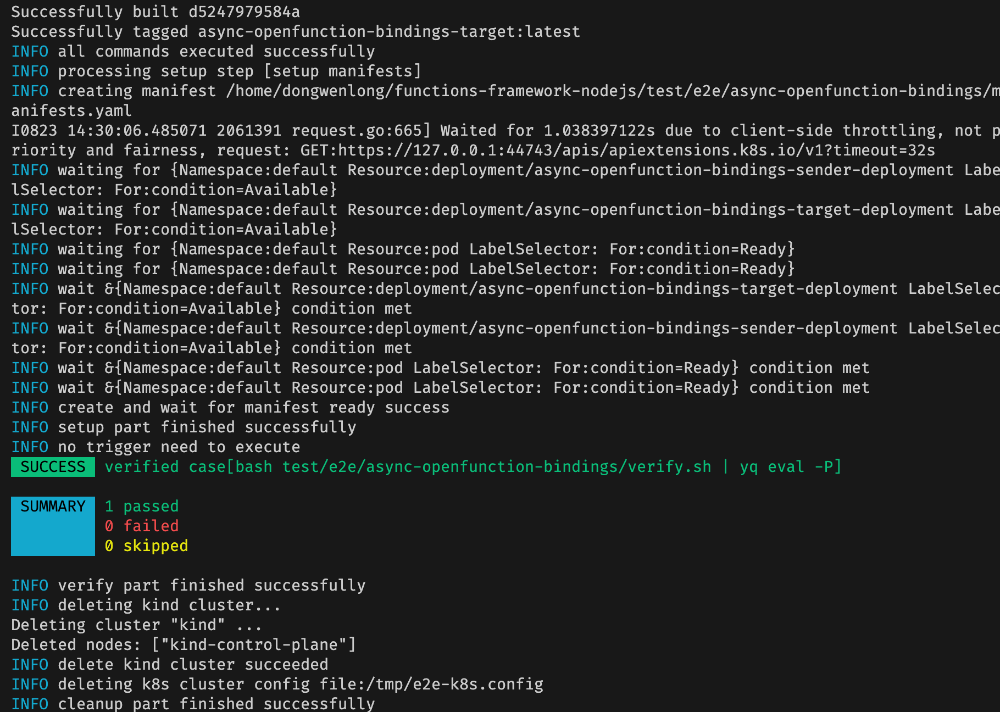
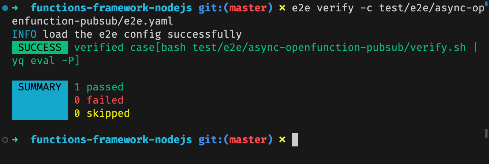
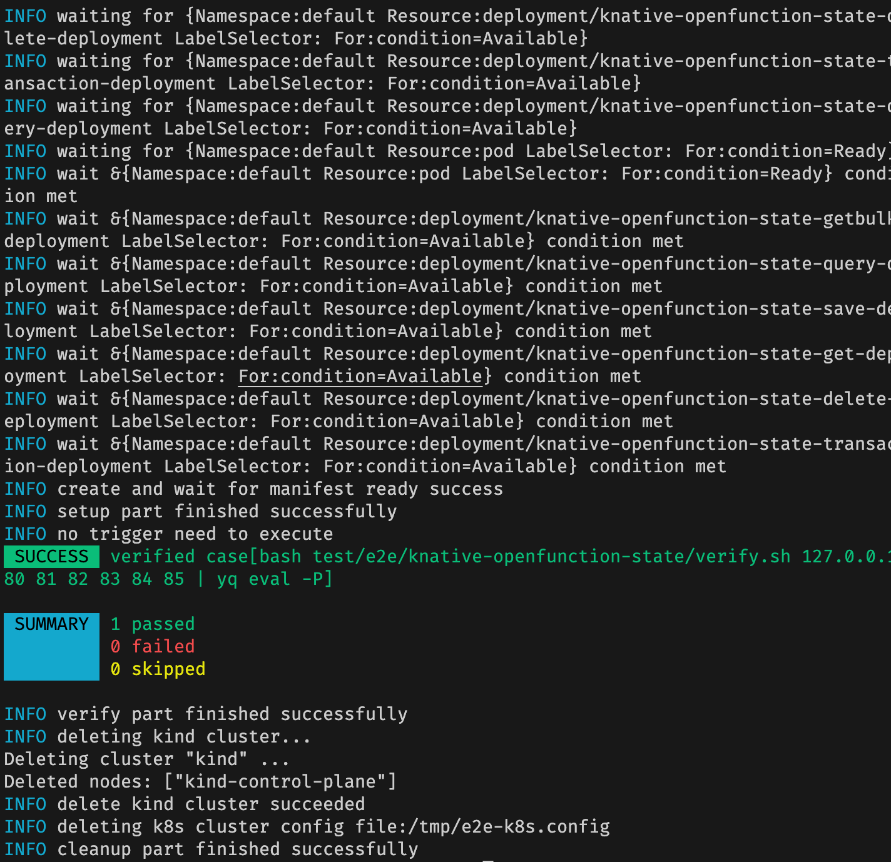

# E2E Test

Since the machine configuration provided by GitHub Actions may be insufficient, there are three tests in the `.github/workflows/e2e.yaml` file that cannot run, so they are commented out, but they can be completely run locally. The following is how to run the e2e test locally process.

## Preparations

### Kind

Kind (Kubernetes in Docker) is a Kubernetes incubation project. Kind is an out-of-the-box Kubernetes environment construction solution. As the name suggests, all the components required for Kubernetes are deployed in a Docker container, which can easily build Kubernetes cluster.

Official Documentation: https://kind.sigs.k8s.io/

**How to install?**

```Bash
# For AMD64 / x86_64
[ $(uname -m) = x86_64 ] && curl -Lo ./kind <https://kind.sigs.k8s.io/dl/v0.20.0/kind-linux-amd64>
# For ARM64
[ $(uname -m) = aarch64 ] && curl -Lo ./kind <https://kind.sigs.k8s.io/dl/v0.20.0/kind-linux-arm64>
chmod +x ./kind
sudo mv ./kind /usr/local/bin/kind
```

### Kubectl

Kind is only responsible for creating the cluster (kubeconfig will be configured), and subsequent cluster operations require kubectl.

Official Documentation: https://kubernetes.io/docs/tasks/tools/install-kubectl-linux/

**How to install?**

```Bash
curl -LO "https://dl.k8s.io/release/$(curl -L -s https://dl.k8s.io/release/stable.txt)/bin/linux/amd64/kubectl"
chmod +x kubectl
sudo mv kubectl /usr/local/bin
```

### SkyWalking Infra E2E

An End-to-End Testing framework that aims to help developers to set up, debug, and verify E2E tests with ease.

Official Documentation: https://skywalking.apache.org/docs/skywalking-infra-e2e/next/readme/

**How to install?**

```bash
git clone https://github.com/apache/skywalking-infra-e2e.git
cd skywalking-infra-e2e
make build
```

After these commands, the e2e execute file path is `bin/$PLATFORM/e2e`. You can use the `move` command to move it to your `usr/local/bin` directory so you can use the `e2e` command anywhere

### Yq

a lightweight and portable command-line YAML processor.

Official Documentation: https://mikefarah.gitbook.io/yq/

**How to install?**

You can download its binary package from the [GitHub website](https://github.com/mikefarah/yq) and put it in the`/usr/local/bin` directory

## How to run

Take `async openfunction bindings e2e test` as an example

### One step

You can execute `e2e run -c test/e2e/async-openfunction-bindings/e2e.yaml`

### More steps

SkyWalking Infra E2E uses a multi-step execution approach.

1. Prepare the environment for this test

```bash
e2e setup -c test/e2e/async-openfunction-bindings/e2e.yaml
```

2. Trigger this test (we will execute a script when validating the test, this step does not need to be executed in this test)

```bash
e2e trigger -c test/e2e/async-openfunction-bindings/e2e.yaml
```

3. Verify this test

```bash
e2e verify -c test/e2e/async-openfunction-bindings/e2e.yaml
```

4. Clean up the testing environment

```bash
e2e cleanup -c test/e2e/async-openfunction-bindings/e2e.yaml
```

If you use the `e2e setup -c **` format, the generated k8s-config will be `/tmp/e2e-k8s.config` 

In the process of setup, it is actually composed of many small processes. You can follow each sub-step to debug step by step, and use `kubectl` to apply and cancel files. And you can observe the status information of each pod at any time.

## Results

1. async openfunction bindings e2e test



2. async openfunction pubsub e2e test



3. knative openfunction state e2e test




